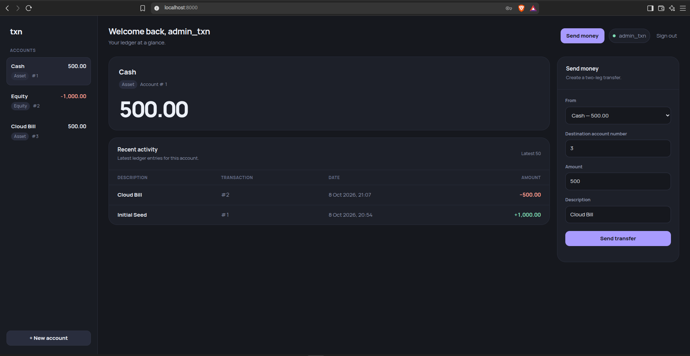

# txn


**A small, correctness-first double-entry ledger API built with Rust and PostgreSQL.**

`txn` is an experimental financial ledger focused on the engineering problems behind transactional systems:

- double-entry accounting
- immutable financial records
- transactional concurrency
- idempotent financial mutations
- safe reversals
- derived balances
- PostgreSQL locking
- authentication and observability

A transaction is represented by immutable ledger entries whose amounts must sum to zero. Account balances are derived from those entries rather than stored separately.



## Run

### Requirements

- Podman or Docker
- Compose

Start the application:

```bash
podman compose up -d --build
```

The API and web UI are available at:

```text
http://localhost:8000
```

Check the service:

```bash
curl http://localhost:8000/health/ready
```

Stop the stack:

```bash
podman compose down
```

## Try it in 60 seconds

### 1. Register a user

```bash
TOKEN=$(
  curl -s http://localhost:8000/users/register \
    -H 'Content-Type: application/json' \
    -d '{
      "username": "alice",
      "password": "password1234"
    }' |
    jq -r '.token'
)
```

### 2. Create an Equity account

```bash
EQUITY_ID=$(
  curl -s http://localhost:8000/accounts \
    -H "Authorization: Bearer $TOKEN" \
    -H 'Content-Type: application/json' \
    -d '{
      "name": "Opening Equity",
      "account_type": "Equity"
    }' |
    jq -r '.id'
)
```

### 3. Create an Asset account

```bash
ASSET_ID=$(
  curl -s http://localhost:8000/accounts \
    -H "Authorization: Bearer $TOKEN" \
    -H 'Content-Type: application/json' \
    -d '{
      "name": "Cash",
      "account_type": "Asset"
    }' |
    jq -r '.id'
)
```

### 4. Fund the Asset account

Send money from the Equity account to the Asset account:

```bash
curl -s http://localhost:8000/transactions \
  -X POST \
  -H "Authorization: Bearer $TOKEN" \
  -H 'Content-Type: application/json' \
  -H 'Idempotency-Key: opening-funding-001' \
  -d "{
    \"source_account_id\": $EQUITY_ID,
    \"destination_account_id\": $ASSET_ID,
    \"amount\": \"1000.00\",
    \"description\": \"Opening funding\"
  }"
```

The resulting Asset account now has a balance of `1000.00`.

Check it:

```bash
curl -s \
  "http://localhost:8000/accounts/$ASSET_ID/balance" \
  -H "Authorization: Bearer $TOKEN"
```

## API

All authenticated endpoints use:

```text
Authorization: Bearer <token>
```

### Users

| Method | Endpoint          | Description                       |
|--------|-------------------|-----------------------------------|
| `POST` | `/users/register` | Register a user and receive a JWT |
| `POST` | `/users/login`    | Authenticate and receive a JWT    |

### Accounts

| Method | Endpoint                     | Description                   |
|--------|------------------------------|-------------------------------|
| `POST` | `/accounts`                  | Create an account             |
| `GET`  | `/accounts`                  | List the user's accounts      |
| `GET`  | `/accounts/:id`              | Get an account                |
| `GET`  | `/accounts/:id/balance`      | Calculate the current balance |
| `GET`  | `/accounts/:id/transactions` | Get account history           |

### Transactions

| Method | Endpoint                    | Description               |
|--------|-----------------------------|---------------------------|
| `POST` | `/transactions`             | Create a two-leg transfer |
| `POST` | `/transactions/:id/reverse` | Reverse a transaction     |

Financial mutation requests require an `Idempotency-Key`.

Example transfer:

```bash
curl -X POST http://localhost:8000/transactions \
  -H "Authorization: Bearer $TOKEN" \
  -H "Content-Type: application/json" \
  -H "Idempotency-Key: payment-001" \
  -d '{
    "source_account_id": 1,
    "destination_account_id": 2,
    "amount": "25.00",
    "description": "Payment"
  }'
```

## Architecture

`txn` uses PostgreSQL as the consistency boundary for financial operations.

Transfers and reversals execute inside database transactions and use:

- idempotency advisory locks
- ordered `FOR UPDATE` account locks
- target-transaction locking for reversals
- database constraints for uniqueness and immutability
- immutable ledger entries with derived balances

The domain model represents transactions as one or more balanced entries:

```text
Transaction
    └── Entries
          ├── account
          └── amount
```

Every transaction must sum to zero, and reversals create new inverse transactions rather than modifying historical records.

See [`docs/ARCH.md`](docs/ARCH.md) for the data model, transaction flows, locking strategy, design decisions, and scale considerations.

## Benchmarks

The project includes benchmarks for:

- baseline transfer throughput
- hot-account contention
- idempotency replay and concurrent races
- reversal throughput and concurrent reversal races
- balance reads as ledger history grows
- account-history reads as ledger history grows

Selected `v0.1.0` results:

| Benchmark              |            Result |
|------------------------|------------------:|
| Transfer               |       1,725 req/s |
| Hot-account contention |         187 req/s |
| Independent reversal   |       1,136 req/s |
| Idempotency replay     |         962 req/s |
| Balance reads          | 5,554 → 272 req/s |
| History reads          | 2,217 → 318 req/s |

All benchmark runs preserved the ledger's zero-sum invariant and completed without unexpected server or transport errors.

See [`docs/BENCHES.md`](docs/BENCHES.md) for the environment, methodology, workload definitions, and complete results.

## Benchmarking locally

The benchmark suite uses a separate PostgreSQL database and benchmark application service so benchmark data does not mix with normal development data.

Start the benchmark environment:

```bash
podman compose --profile bench up -d --build
```

Run an individual benchmark:

```bash
./scripts/run-bench.sh transfer
```

Other available benchmarks:

```bash
./scripts/run-bench.sh contention
./scripts/run-bench.sh idempotency
./scripts/run-bench.sh reversal
./scripts/run-bench.sh reads
./scripts/run-bench.sh history
```

`run-bench.sh` resets the benchmark database before each run.

## Project structure

```text
txn/
├── src/
├── benches/
│   ├── common/
│   ├── transfer.rs
│   ├── contention.rs
│   ├── idempotency.rs
│   ├── reversal.rs
│   ├── reads.rs
│   └── history.rs
├── docs/
│   ├── ARCH.md
│   └── BENCHES.md
├── scripts/
├── migrations/
├── static/
├── compose.yaml
├── Dockerfile
└── Cargo.toml
```

## Status

`txn` is a `v0.1.0` project focused on correctness-first ledger mechanics rather than production banking infrastructure.

Known limitations and future work are documented in the architecture and benchmark documentation.