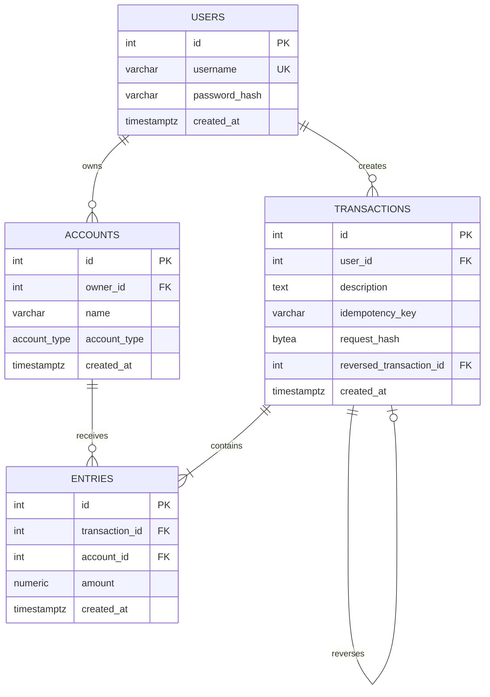
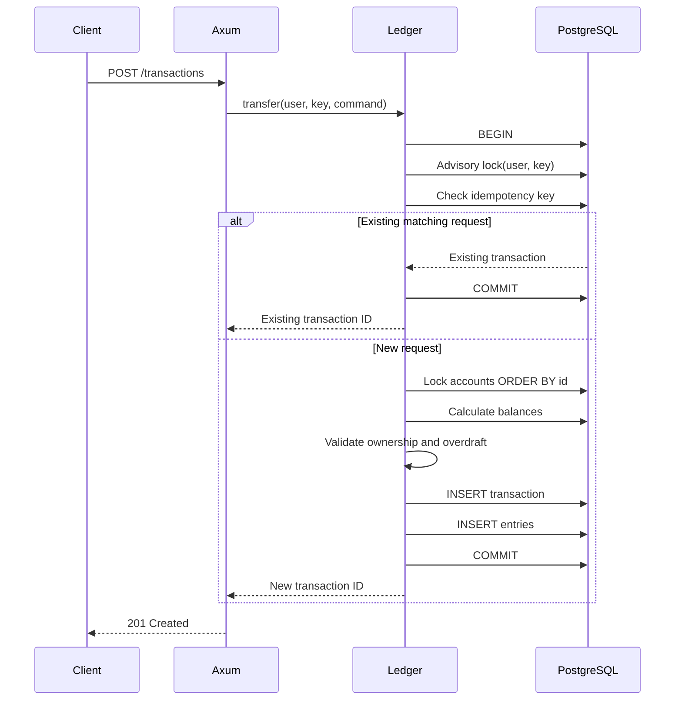
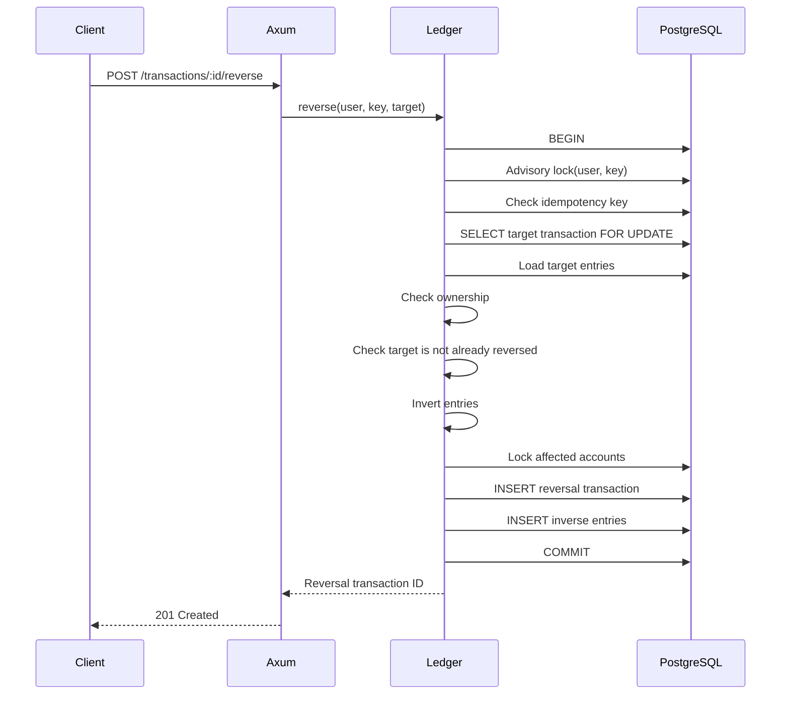

# Architecture

## Overview

`txn` is an HTTP ledger service built around PostgreSQL transactions.

The financial model is:

```text
Transaction
    └── Entries
          ├── account
          └── amount
```

Every transaction must contain at least two entries and the sum of all entry amounts must be zero.

A two-leg transfer is:

```text
Source       -100.00
Destination  +100.00
--------------------
                0.00
```

Transactions and entries are immutable. A reversal creates a new transaction containing the inverse entries instead of modifying the original transaction.

Balances are derived from entries:

```text
balance(account) = SUM(entries.amount)
```

The API is intentionally small. The current public domain supports `Asset` and `Equity` accounts and exposes two-leg transfers, although the entry model itself supports arbitrary multi-leg transactions.

---

## Components

```text
HTTP
 │
 ▼
Axum handlers
 │
 ├── authentication
 ├── request validation
 └── response mapping
 │
 ▼
Ledger layer
 │
 ├── idempotency
 ├── ownership
 ├── account locking
 ├── balance checks
 ├── transaction creation
 └── reversal
 │
 ▼
SQLx
 │
 ▼
PostgreSQL
```

### `app`

Contains HTTP routes and request/response types.

```text
app/users.rs
app/accounts.rs
app/transactions.rs
app/health.rs
app/metrics.rs
```

### `core`

Contains domain rules and authentication.

```text
core/types.rs
core/ledger.rs
core/auth.rs
core/errors.rs
```

### `db`

Contains PostgreSQL queries and database row types.

```text
db/queries.rs
db/rows.rs
```

---

## Data model



### Users

Users own accounts and create transactions.

`username` is unique.

### Accounts

Accounts belong to one user and have an account type.

The Rust/API model currently exposes:

```text
Asset
Equity
```

Asset accounts cannot have negative balances. Equity accounts can.

The PostgreSQL enum also contains `liability`, `revenue`, and `expense`, but those are not currently represented by the Rust `AccountType` enum.

Account names are unique per user.

### Transactions

A transaction is the immutable header for a financial operation.

It stores:

- the user that created it
- description
- idempotency key
- request fingerprint
- optional reversal target
- creation time

### Entries

Entries contain the financial postings.

Each entry references:

- one transaction
- one account
- one non-zero amount

Entries are immutable after insertion.

---

## Domain invariants

`Entries::new()` validates the core ledger invariants before persistence.

A transaction must:

1. contain at least two postings
2. contain no zero-valued postings
3. contain no duplicate account postings
4. sum exactly to zero

The zero-sum invariant is:

```text
SUM(transaction.entries.amount) = 0
```

The database separately enforces:

```text
entries.amount <> 0
```

Transactions and entries cannot be updated or deleted because PostgreSQL triggers reject both operations.

### Account overdrafts

Asset accounts cannot become negative.

The ledger locks affected accounts, calculates their current balances, and rejects a debit when:

```text
current_balance + debit < 0
```

Equity accounts are allowed to go negative.

### Ownership

For a transfer, the caller must own the source account.

The destination account does not need to belong to the caller. This allows transfers between users.

For reversals, the caller must own at least one account involved in the target transaction.

---

## Transfer

The HTTP endpoint is:

```text
POST /transactions
```

with:

```json
{
  "source_account_id": 1,
  "destination_account_id": 2,
  "amount": "100.00",
  "description": "Payment"
}
```

and an `Idempotency-Key` header.

The flow is:



The implementation builds the entries first:

```text
source      -amount
destination +amount
```

Then `post()` performs the common persistence path.

---

## Account locking

Before checking balances, all accounts involved in the transaction are locked:

```sql
SELECT id, account_type
FROM accounts
WHERE id = ANY($1::int[])
ORDER BY id
FOR UPDATE
```

The ordering is intentional.

Without deterministic ordering:

```text
Transaction A: lock account 1 → account 2
Transaction B: lock account 2 → account 1
```

could deadlock.

With `ORDER BY id`, both acquire locks in the same order.

The balance query runs while these rows remain locked, so two concurrent debits cannot both observe the same available balance.

---

## Idempotency

Every financial mutation requires an idempotency key.

The request fingerprint is:

```text
SHA-256( operation type, command payload )
```

The database stores both:

```text
(user_id, idempotency_key)
request_hash
```

The idempotency flow is:

```text
BEGIN
  ↓
pg_advisory_xact_lock(user_id, key)
  ↓
lookup (user_id, key)
  │
  ├── missing
  │      ↓
  │    execute operation
  │      ↓
  │    insert transaction
  │
  ├── exists + same fingerprint
  │      ↓
  │    replay existing transaction
  │
  └── exists + different fingerprint
         ↓
       reject
```

The database also enforces:

```sql
UNIQUE (user_id, idempotency_key)
```

### Advisory lock

The lock is:

```sql
SELECT pg_advisory_xact_lock(
    $user_id,
    hashtext($idempotency_key)
)
```

It is transaction-scoped, so it is released automatically when the transaction commits or rolls back.

The lock prevents two concurrent retries from both observing an unused idempotency key before either one inserts the transaction.

---

## Reversal

The endpoint is:

```text
POST /transactions/{id}/reverse
```

A reversal never modifies the original transaction.

For:

```text
Original
A  -100
B  +100
```

the reversal is:

```text
Reversal
A  +100
B  -100
```

The original transaction remains part of the immutable history.

The flow is:



There are two protections against double reversal:

```text
application:
    target.reversed_transaction_id
    is_reversed(target)

database:
    UNIQUE(reversed_transaction_id)
```

The target transaction is locked before checking these conditions.

---

## The three locks

| Lock                                   | Prevents                                                           |
|----------------------------------------|--------------------------------------------------------------------|
| Advisory lock on `(user, key)`         | Two retries of one request both passing the "key unused" check     |
| `FOR UPDATE` on accounts, in ID order  | Two debits both seeing enough balance; ID order prevents deadlocks |
| `FOR UPDATE` on the target transaction | Two reversals of the same transaction                              |

These locks solve different concurrency problems and are not interchangeable.

---

## Immutability

The application never updates or deletes financial history.

PostgreSQL enforces this with triggers:

```text
UPDATE transactions → rejected
DELETE transactions → rejected

UPDATE entries      → rejected
DELETE entries      → rejected
```

Corrections are represented as new transactions.

This is why reversal is modeled as another transaction instead of modifying the original one.

---

## Derived balances

The database does not store an account balance.

Balances are calculated using:

```sql
SELECT COALESCE(SUM(amount), 0.0)
FROM entries
WHERE account_id = $1
```

This keeps the ledger as the single source of truth.

The tradeoff is read cost: balance calculation gets more expensive as the number of entries for an account grows. The benchmark in [`BENCHES.md`](BENCHES.md) measures this directly.

### Rejected alternative: stored balances

A stored balance would make reads cheaper:

```text
accounts.balance
```

but every financial mutation would need to update both:

```text
entries
accounts.balance
```

That creates another mutable representation of financial state that can diverge from the ledger.

For this project, the simpler model is preferred.

---

## Idempotency design choice

### Chosen

```text
advisory lock
    ↓
lookup
    ↓
execute
```

### Rejected: insert first

An alternative is to attempt the idempotency-row/transaction insert first and use the unique constraint to detect races.

That can work, but it pushes more of the concurrency protocol into constraint-error handling.

The advisory-lock approach makes the intended critical section explicit:

```text
one (user, key) → one executing request
```

The unique constraint remains as a database-level backstop.

---

## Runtime SQL

The project uses SQLx runtime queries:

```rust
sqlx::query(...)
sqlx::query_as(...)
sqlx::query_scalar(...)
```

rather than compile-time query macros.

### Rejected alternative: SQLx macros

Compile-time SQL checking would catch more query/schema mismatches during compilation.

The current implementation instead keeps query execution independent of compile-time database metadata.

This is simpler for the small application and container workflow, at the cost of weaker compile-time guarantees.

---

## Authentication

Passwords are hashed with Argon2.

Authentication uses signed JWTs.

JWT claims contain:

```text
sub
iat
exp
```

The token lifetime is 24 hours.

Authentication middleware extracts the Bearer token and inserts:

```rust
AuthUser { id }
```

into request extensions.

The account and transaction routers are protected by this middleware.

---

## Reads

### Account balance

```text
GET /accounts/{id}/balance
```

The handler:

1. verifies account ownership
2. calculates the balance from `entries`

### Account history

```text
GET /accounts/{id}/transactions
```

The query:

```sql
SELECT
    t.id AS transaction_id,
    t.description,
    e.amount,
    t.created_at,
    t.reversed_transaction_id AS reverses
FROM entries e
JOIN transactions t
    ON t.id = e.transaction_id
WHERE e.account_id = $1
ORDER BY e.id DESC
LIMIT 50
```

The endpoint currently returns a fixed 50-entry window rather than supporting pagination.

---

## Database constraints

The important database constraints are:

```text
users.username
    UNIQUE

accounts(owner_id, name)
    UNIQUE

transactions(user_id, idempotency_key)
    UNIQUE

transactions(reversed_transaction_id)
    UNIQUE

entries.amount
    CHECK (amount <> 0)
```

Foreign keys enforce ownership relationships between:

```text
users → accounts
users → transactions
transactions → entries
accounts → entries
transactions → transactions (reversal)
```

---

## What I would change at scale

### Stored or materialized balances

Keep the immutable ledger as the source of truth but maintain a balance projection for fast reads.

### History pagination

Replace the fixed `LIMIT 50` response with cursor-based pagination.

### Idempotency retention

Give idempotency records a retention policy instead of keeping them forever.

### Public identifiers

Replace sequential integer IDs with opaque public identifiers where exposing resource existence is undesirable.

### Authentication hardening

Add token revocation/refresh, rate limiting, and login brute-force protection.

### Multiple currencies

Make currency an explicit property of monetary amounts and prevent incompatible currencies from being combined in one transaction.

### Database-level accounting validation

Move cross-row zero-sum enforcement closer to the database where practical, while keeping the domain validation in Rust.

### Read scaling

Use materialized projections or replicas for read-heavy workloads while keeping financial writes serialized through the primary database.

### Connection pool tuning

Tune application connection-pool size against PostgreSQL capacity and workload rather than using a fixed value for all deployments.

---

## Summary

The main consistency boundary is PostgreSQL.

Transfers and reversals execute as database transactions, with:

```text
idempotency lock
        +
account row locks
        +
target transaction lock
        +
database constraints
        +
immutable records
```

The ledger itself remains append-only, while balances are derived from its postings.

The benchmark results and methodology are documented in [`BENCHES.md`](BENCHES.md).